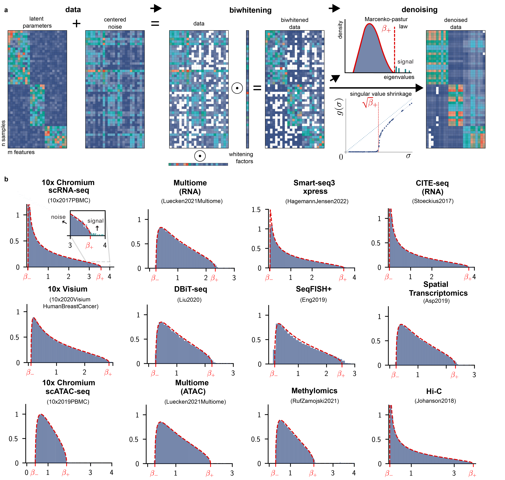

# Biwhitened Principal Component Analysis (BiPCA) # 


BiPCA is a python package for processing high-dimensional omics count data, such as scRNAseq, spatial transcriptomics, scATAC-seq, and many others. 

## Installation ##

BiPCA can be installed as 

```
pip install git+https://github.com/Klugerlab/bipca.git
```
## Getting Started ##

- Running BiPCA with a built-in dataset: [tutorial-0-quick_start.ipynb](python/tutorials/tutorial-0-quick_start.ipynb)
- Running BiPCA with unfiltered dataset from scanpy: [tutorial-1-pbmc_scrna_scanpy.ipynb](python/tutorials/tutorial-1-pbmc_scrna_scanpy.ipynb)

## Reproducing figures ##

[Figure1_Suppfig1.ipynb](python/bipca/experiments/figures/Figure1_Suppfig1.ipynb) regenerates Fig1 and Supplemental fig1 used in the manuscript. Codes for the remaining figures are documented as individual functions in [figure.py](python/bipca/experiments/figures/figures.py). For example, run the following to reproduce the marker gene figure:

```
from bipca.experiments.figures import Figure_marker_genes
fig_obj = Figure_marker_genes(base_plot_directory="./result/",output_dir="./data/",formatstr="png")
fig_obj.plot_figure(save=True)
```

## Reference ##